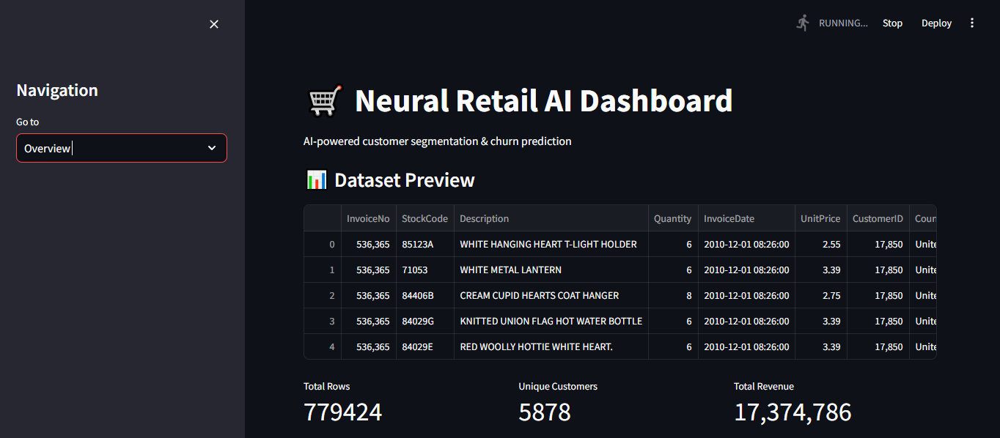
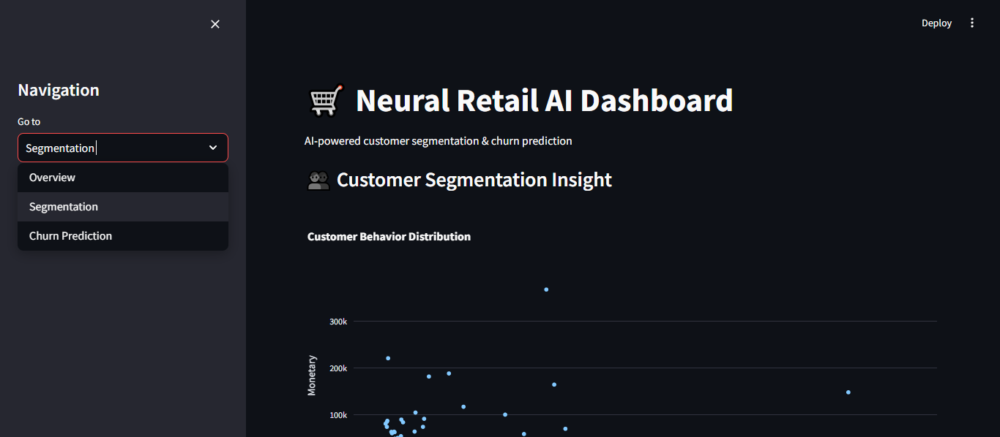
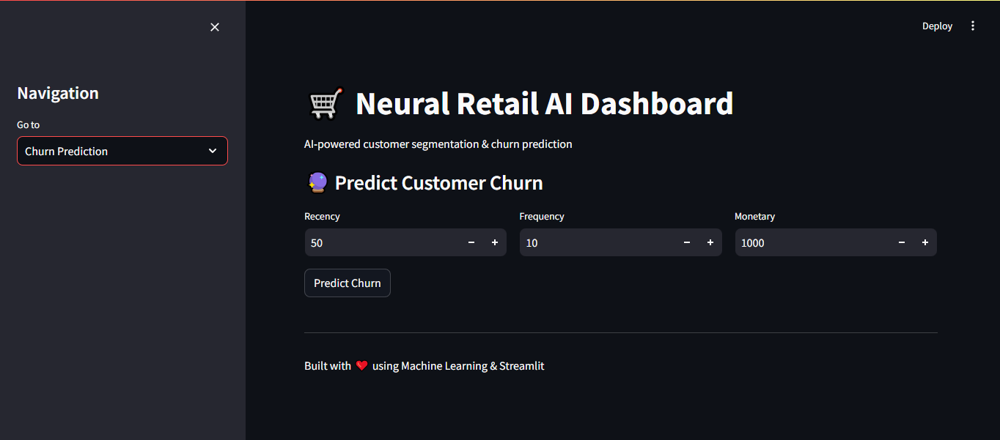

# 🛒 Neural Retail AI

### AI-Powered Customer Segmentation & Churn Prediction System

---

## 📌 Overview

Neural Retail AI is an end-to-end machine learning project that analyzes retail transaction data to generate customer insights.
It performs **data processing, feature engineering, customer segmentation, and churn prediction**, and presents results through an interactive dashboard.

---

## 🚀 Key Features

* 🔄 **Data Pipeline**

  * Multi-source data ingestion
  * Data cleaning & validation

* 🧠 **Feature Engineering**

  * RFM (Recency, Frequency, Monetary) analysis

* 🤖 **Machine Learning Models**

  * Customer Segmentation using K-Means
  * Churn Prediction using XGBoost

* 📊 **Interactive Dashboard**

  * Built using Streamlit
  * Real-time churn prediction
  * Data visualization

---

## 🏗️ Project Structure

```
neural-retail-ai/
│
├── data/
│   ├── raw/
│   └── processed/
│
├── models/
│
├── src/
│   ├── data/
│   ├── features/
│   ├── models/
│   ├── config/
│   └── test_ingestion.py
│
├── app.py
├── requirements.txt
└── README.md
```

---

## ⚙️ Tech Stack

* **Programming Language:** Python
* **Libraries:** pandas, numpy, scikit-learn, xgboost
* **Visualization:** plotly, matplotlib
* **Dashboard:** streamlit
* **Model Persistence:** joblib

---

## 🔄 Workflow

1. Data Ingestion (multiple datasets)
2. Data Cleaning & Preprocessing
3. Feature Engineering (RFM)
4. Customer Segmentation (K-Means)
5. Churn Prediction (XGBoost)
6. Model Saving
7. Dashboard Deployment

---

## 📊 Machine Learning Details

### 📌 Customer Segmentation

* Algorithm: K-Means
* Input Features: Recency, Frequency, Monetary
* Output: Customer clusters (behavior-based groups)

### 📌 Churn Prediction

* Algorithm: XGBoost Classifier
* Target: Churn (based on inactivity threshold)
* Evaluation: Accuracy Score

---

## 🖥️ Run Locally

### 1. Clone the repository

```bash
git clone https://github.com/BIBHUPRASAD14/neural-retail-ai.git
cd neural-retail-ai
```

### 2. Install dependencies

```bash
pip install -r requirements.txt
```

### 3. Run pipeline

```bash
python -m src.test_ingestion
```

### 4. Launch dashboard

```bash
streamlit run app.py
```

---

## 📸 Dashboard Preview

### 🏠 Overview
<p align="center">
  
</p>

### 👥 Segmentation
<p align="center">
  
</p>

### 🔮 Churn Prediction
<p align="center">
  
</p>

---

## 🎯 Results & Insights

* Identified high-value (VIP) customers
* Detected churn-risk customers
* Built an interactive tool for real-time prediction
* Enabled data-driven customer targeting

---

## 📌 Future Improvements

* Add MLflow for experiment tracking
* Deploy on cloud (AWS / Streamlit Cloud)
* Improve model performance with advanced features
* Real-time API using FastAPI

---

## 🚀 Live Demo

👉 https://your-app-name.streamlit.app

---

## 👨‍💻 Author

**Bibhuprasad Bhattacharjee**
🔗 GitHub: https://github.com/BIBHUPRASAD14

---

## ⭐ If you found this useful, give it a star!
